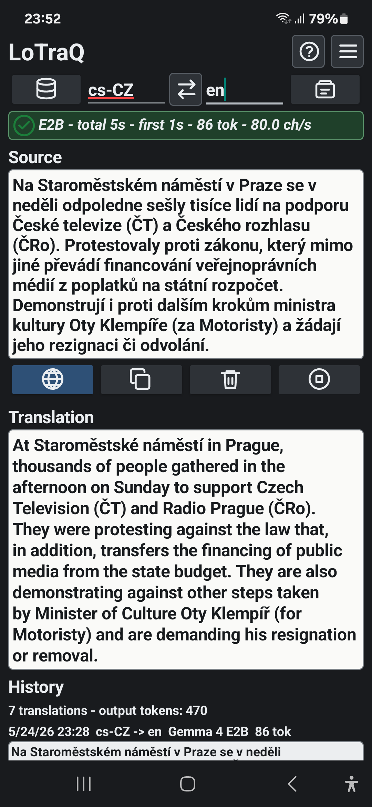

# LoTraQ

**Free local AI translation. Android direct APK now, Windows 1.2 preview now.
No ads, no account, no cloud translation.**

LoTraQ is built for people who want a practical translator that runs on their
own device. Paste text, choose languages, load a local AI model, translate, and
copy the result. After a model is downloaded or imported, translation runs
locally.

## Android Download

Current public Android build:

- [lotraq-v1.5.0-direct-release-signed.apk](android/lotraq-v1.5.0-direct-release-signed.apk)
- SHA-256: `0562a0ac897562c03be1dfafd6d85903c1ff376bf485df299913feddabcde946`
- Android 8.0+ / API 26+
- `arm64-v8a` phones only
- Package: `com.olderthanold.lotraq`

This is a direct-download APK, not a Play Store release.

See [android/README.md](android/README.md) for Android install and signing
notes, and [android/RELEASE_NOTES.md](android/RELEASE_NOTES.md) for Android
1.5 changes.

## Windows 1.2 Download

Current Windows 1.2 build:

- [lotraq-windows-v1.2.0-win-x64.7z](windows/lotraq-windows-v1.2.0-win-x64.7z)
- SHA-256: `2f76a108f0c5174a6e872c0f4ba846dc0a0b53e116a455fe06316199625920fa`
- Windows 11 x64
- Portable 7z archive, no installer
- Includes the LoTraQ WPF app and pinned local `llama.cpp` CPU/Vulkan runtimes
- Does not include a GGUF model

This is a Windows preview focused on local GGUF translation with a bundled
`llama.cpp` runtime. The Windows executables are not code signed, so Windows
SmartScreen or antivirus tools may warn before first run.

See [windows/README.md](windows/README.md) for Windows 1.2 setup and limits,
and [windows/RELEASE_NOTES.md](windows/RELEASE_NOTES.md) for rerelease notes.

## What It Does

- Translates text locally on-device/on-machine.
- Supports English plus 55 target locales, including Czech, German, French,
  Spanish, Japanese, Korean, Chinese, Ukrainian, and more.
- Keeps local translation history.
- Lets you copy source text, translated text, and history items.
- Android supports LiteRT-LM `.litertlm` model download, import, delete, and
  visible load status.
- Android 1.5 adds model-backed OCR for installed Gemma 4 E2B/E4B vision
  models, while keeping fast Latin OCR as the default.
- Android 1.5 allows same-language Source and Target as rewrite mode driven by
  Translation instructions.
- Android 1.4 added Simple/Advanced Settings and Photo OCR camera capture with
  app-private temporary photos and explicit Save pic.
- Android also supports saved-image OCR, custom local `.litertlm` model
  imports, per-model context settings, backend preference, MTP, memory status,
  and token speed.
- Windows 1.2 supports standard GGUF download, external GGUF references,
  streaming output, same-language rewrite/cleanup, thinking separation, and
  local `llama.cpp` CPU/Vulkan inference through a private `127.0.0.1` process.
- Shows practical runtime feedback such as loaded/not loaded, generation time,
  first-token latency, output tokens, and speed where available.

## Android Quick Start

1. Download the current APK from the Android link above.
2. On Android, allow installing apps from your browser or file manager when
   prompted.
3. Install the APK.
4. Open LoTraQ.
5. Open Settings, then download or import a model.
6. Return to the main screen, choose source and target languages, paste text,
   then tap Translate. You can also tap Load first to prepare the selected
   model.

Model files are large, so use Wi-Fi or unlimited data for the first download.
After a model is installed, translation runs locally.

Android 1.5 can open Photo OCR from the main screen, attach a saved image or
capture a temporary camera photo, extract editable text locally, and hand it
off to translation. Latin OCR is fast and Latin-script only. Installed Gemma 4
E2B/E4B models can also be selected as OCR engines for model OCR. Captured OCR
photos stay in app-private cache unless you explicitly use Save pic. Custom
models are local `.litertlm` imports from Settings; there is no custom URL or
model-registry flow.

## Windows 1.2 Quick Start

1. Download `lotraq-windows-v1.2.0-win-x64.7z`.
2. Extract the 7z archive to a normal writable folder.
3. Double-click `Run-LoTraQ.cmd`.
4. Open Settings.
5. Use `Download` for the standard TranslateGemma GGUF, or `Add GGUF` to
   reference an existing local GGUF file.
6. Return to Main, choose languages, paste text, then translate.

Keep the extracted folder together. The Windows app expects its app files and bundled
runtime folders to stay next to `Run-LoTraQ.cmd`.

## Models

Android 1.5 uses LiteRT-LM models:

| Model | Role | Size | Notes |
| --- | --- | ---: | --- |
| Gemma 4 E2B IT LiteRT-LM | Default | 2.59 GB | Fast LiteRT target for phone use. |
| TranslateGemma 4B INT4 LiteRT-LM | Optional | 2.01 GB | Translation-tuned; CPU fallback is slow on the tested phone. |
| Gemma 4 E4B IT LiteRT-LM | Optional | 3.66 GB | Larger memory-pressure test; may fail on smaller phones. |

Android also accepts unknown imported `.litertlm` files as local custom models.
Custom model quality, language behavior, and resource use depend on the model.
Custom model OCR capability is not auto-detected in Android 1.5; model OCR is
listed only for installed standard Gemma 4 E2B/E4B models.

Windows 1.2 uses GGUF through `llama.cpp` and does not bundle a model:

| Model | Role | Size | Notes |
| --- | --- | ---: | --- |
| TranslateGemma 4B IT Q4_K_S GGUF | Suggested Windows model | 2.38 GB | Download in Settings or reference your own local file. |

## Privacy

LoTraQ does not require an account and does not send your source text or
translations to a server. Android can connect to model hosts when you download
a model. Android Photo OCR processes selected or captured images locally with
Latin OCR or installed Gemma OCR models and does not upload images or extracted
text. Windows 1.2 can download the standard GGUF model, reference an external
local GGUF file, and uses local `127.0.0.1` inference. See
[PRIVACY.md](PRIVACY.md).

## Source

This repository is only for public release downloads and notices. Development
source is maintained separately so this repo can stay small and focused.

See [THIRD_PARTY_NOTICES.md](THIRD_PARTY_NOTICES.md) for model, runtime, and
third-party notices.

## Language Coverage Notes

- TranslateGemma is the translation-tuned model family. Google describes it as
  designed for translation tasks across 55 languages.
- Gemma 4 is a broader general-purpose multilingual model family. Google AI
  docs describe Gemma 4 as supporting over 140 languages. The Gemma 4 E2B model
  card is more conservative for practical use: 35+ languages out of the box,
  with pre-training on 140+ languages.
- In LoTraQ, TranslateGemma is the purpose-built choice when translation quality
  for a supported language pair matters most. Gemma 4 is broader multilingual
  local AI support, not a dedicated translation guarantee for every app locale.

Sources:

- [Google AI Gemma docs](https://ai.google.dev/gemma/docs)
- [Gemma 4 E2B model card](https://huggingface.co/google/gemma-4-E2B)
- [TranslateGemma announcement](https://blog.google/innovation-and-ai/technology/developers-tools/translategemma/)
